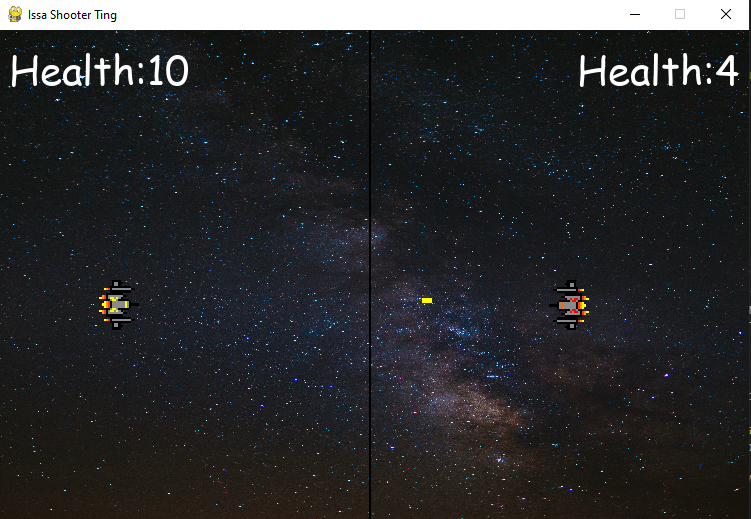
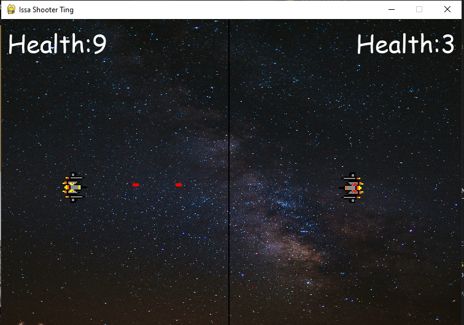
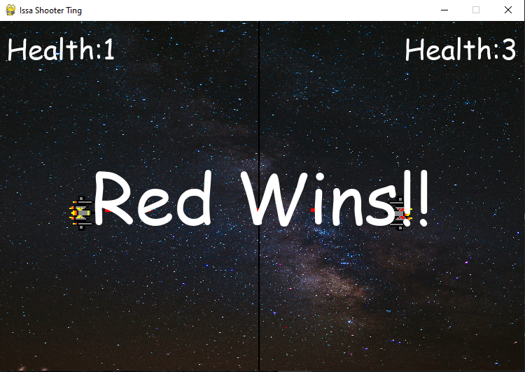

# Python game- Issa Shooter Game

I built this game as a coding exercise in my python learning journey. It can be run directly from any code editor that supports the python env.

# 
# 
# 

# Built with 
- python.
- pygame module.

# What I Learned
- how to use python sematics, functions, classes and more.
- How to use python modules i.e pygame to make a desktop game.
- Video game design fundamentals.
- Setting up a game loop.
- integrating audio inside a video game.

# Author

- Kiprop Simboley.